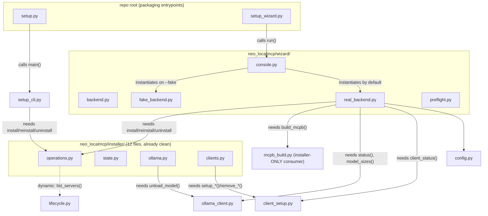
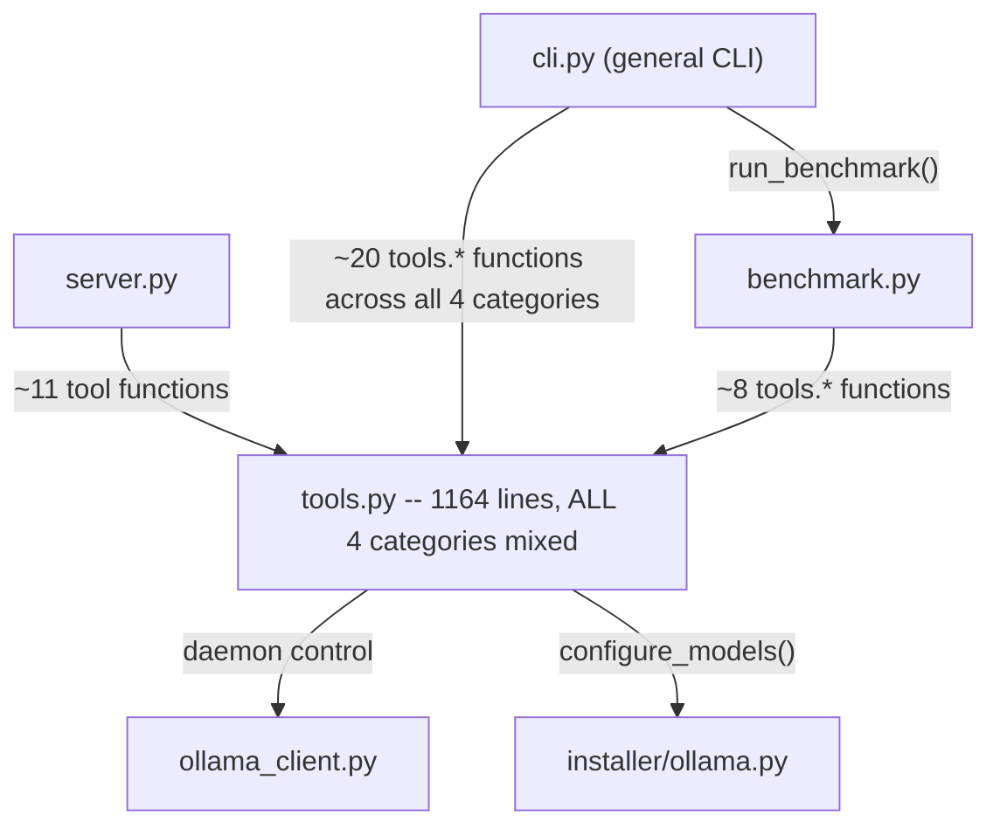
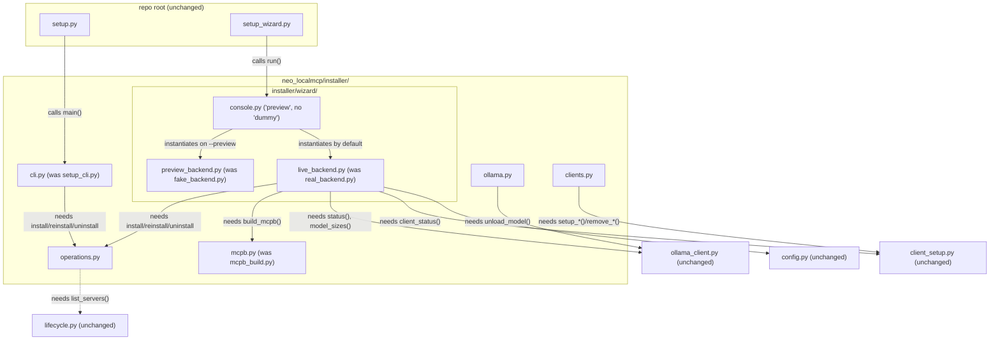
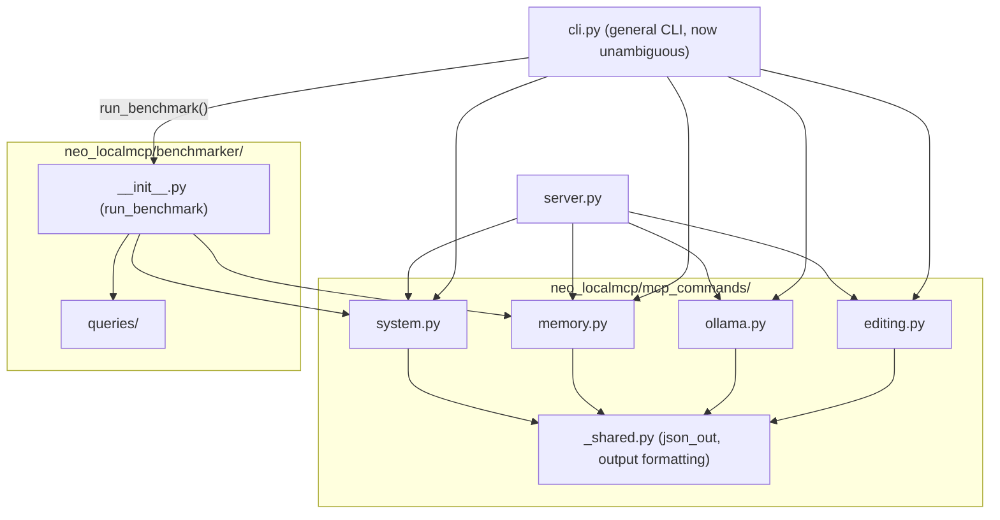

# Installer & MCP-command reorg — design

**Date:** 2026-07-06
**Status:** approved (brainstorming), pending implementation plan

## Origin

The installer/wizard code and the MCP tool-command code have grown without a
deliberate file/folder policy. The owner's complaint: "the subfiles for these two
installers are scattered all over the place with no clear thought on how it will
be used." The ask was not a mechanical file move — it's a full functional rework:
merge/split/rename where it clarifies responsibility, eliminate duplication, and
end with a precise, verifiable dependency graph (mermaid, file-level, edges
labeled with the actual symbol needed) for both the current and the target state.

A parallel question raised mid-investigation: do Claude Code's `/neo-localmcp:*`
slash commands touch this repo at all? Answer, confirmed by reading
`client_setup.py`: **yes, entirely.** They are static markdown files at
`neo_localmcp/templates/claude-code/commands/neo-localmcp/*.md`, copied verbatim
to `~/.claude/commands/neo-localmcp/` by `setup_claude_code()`. Claude Code does
not derive them from the MCP tool schema. This directory is installer-adjacent
content and stays where it is (see "Explicitly out of scope").

## Investigation method

Three parallel read-only agents mapped, file-by-file: every function/class
defined, every import (what it needs), every importer (who needs it), and test
coverage, for `neo_localmcp/installer/` (12 files), `neo_localmcp/wizard/` (7
files), and the scattered top-level installer files plus the MCP tool/command
layer (`tools.py`, `server.py`, `cli.py`, `benchmark.py`). Findings below are
sourced from that map, not assumption.

## Key finding: the packages are not actually a mess

`neo_localmcp/installer/` (~3,900 lines, 12 files: `types`, `paths`, `output`,
`state`, `processes`, `migration`, `runtime`, `verification`, `ollama`, `clients`,
`operations`, `__init__` barrel) and `neo_localmcp/wizard/` (~1,800 lines, 7
files: `backend`, `console`, `real_backend`, `fake_backend`, `preflight`,
`_ansi`, `__init__`) are each **already cleanly layered internally** — strict
dependency direction, no duplicated logic, dependency-injected seams for
testing. Two suspected overlaps were checked and ruled out:

| Suspected overlap | Verdict |
|---|---|
| `installer/ollama.py` (80 lines) vs `ollama_client.py` (382 lines) | No duplication. `installer/ollama.py` is a thin lifecycle-scoped policy wrapper that calls `ollama_client.unload_model()`. Clean separation: daemon control vs. lifecycle policy. |
| `lifecycle.py` (304 lines) vs `installer/operations.py` + `installer/processes.py` | No duplication. `lifecycle.py` is server-registry/graceful-stop coordination (used live by `server.py` too); `installer/operations.py` and `processes.py` are lifecycle *sequencing* and shutdown *policy*, which consume `lifecycle.py` as a dependency, not a competitor. |

**So no internal rework is needed inside `installer/` or `wizard/`.** The actual
problems are three specific, fixable things:

1. **Naming collision at the top level** — `cli.py` (general MCP CLI, 337 lines)
   sits beside `setup_cli.py` (installer CLI, 449 lines). Same suffix, unrelated
   domains, easy to grab the wrong one.
2. **The installer's two frontends have no shared home** — `setup_cli.py` and
   `wizard/` both exist purely to drive `installer/operations.py`, but one is a
   loose top-level file and the other is an unrelated-looking sibling package.
3. **`tools.py` is a 1,164-line monolith** mixing four logical categories
   (system, memory, ollama, editing) with zero internal file boundaries — the one
   genuine "needs splitting" case found.

Everything else that looked scattered — `config.py`, `ollama_client.py`,
`client_setup.py`, `lifecycle.py` — is correctly shared between the installer
*and* the live MCP server (`tools.py`, `server.py`, `cli.py` all depend on at
least one of them), so it belongs at top level. Moving it into `installer/`
would just relocate the confusion in the other direction. `mcpb_build.py` is the
one exception: its only consumer anywhere in the repo is
`wizard/real_backend.py`, so it is installer-only and moves in.

## Current-state dependency graphs

Full mermaid source, portable for reuse in docs/README, saved at:

- [`mermaid_diagrams/20260706_installer_wizard_before.mmd`](../../../mermaid_diagrams/20260706_installer_wizard_before.mmd)
- [`mermaid_diagrams/20260706_mcp_commands_before.mmd`](../../../mermaid_diagrams/20260706_mcp_commands_before.mmd)





(See the `.mmd` files for the fully detailed, symbol-labeled versions — trimmed
here for readability.)

## Target design

### File tree

```
neo_localmcp/
  installer/
    __init__.py, types.py, paths.py, output.py, state.py,      # unchanged
    processes.py, migration.py, runtime.py, verification.py,   # unchanged
    ollama.py, clients.py                                      # unchanged
    mcpb.py                    # moved from neo_localmcp/mcpb_build.py (build_mcpb() body unchanged)
    cli.py                     # moved+renamed from neo_localmcp/setup_cli.py
    wizard/                    # moved from neo_localmcp/wizard/
      __init__.py, backend.py, preflight.py, _ansi.py          # unchanged
      console.py                # unchanged logic; "dummy" terminology purged (see below)
      live_backend.py           # renamed from real_backend.py; RealBackend -> LiveBackend
      preview_backend.py        # renamed from fake_backend.py; FakeBackend -> PreviewBackend

  mcp_commands/                # new -- split of tools.py's 1164 lines
    __init__.py
    system.py                  # init, status, where, doctor, model_status, repo_index/reindex/refresh, repo_lookup, reset_repo, reset_all
    memory.py                  # prepare_context, context_prepare, file_context, file_excerpts, record_change, test_determinism
    ollama.py                  # ollama_status, ollama_ensure, ollama_control, set_ollama
    editing.py                 # summarize_file, apply_unified_patch
    _shared.py                 # cross-category helpers only (json_out/_format etc.) -- no category imports another category

  benchmarker/                 # renamed from benchmark.py + benchmark_queries/
    __init__.py                # run_benchmark() and its helpers, unchanged logic
    queries/                   # moved from neo_localmcp/benchmark_queries/

  server.py, cli.py, client_setup.py, ollama_client.py,
  lifecycle.py, config.py, templates/, repo_memory.py,
  query.py, utils.py, identity.py, context_worker.py     # all unchanged -- genuinely cross-cutting

setup.py           # repo root, unchanged location; delegates to neo_localmcp.installer.cli.main()
setup_wizard.py    # repo root, unchanged location; delegates to neo_localmcp.installer.wizard.console.run()
```

### Naming decisions (owner-confirmed)

| Old | New | Why |
|---|---|---|
| `neo_localmcp/setup_cli.py` | `neo_localmcp/installer/cli.py` | Installer's CLI frontend; belongs inside the domain it drives. No internal split needed — 449 lines / 14 functions is cohesive. |
| `neo_localmcp/wizard/` | `neo_localmcp/installer/wizard/` | Installer's interactive UI frontend; same reasoning. Kept as a package (already 7 files), no extra `wizard_helper/` nesting layer since there's nothing to split into it. |
| `neo_localmcp/mcpb_build.py` | `neo_localmcp/installer/mcpb.py` | Sole consumer anywhere in the repo is the wizard's real backend — installer-only. |
| `neo_localmcp/wizard/real_backend.py` / `RealBackend` | `installer/wizard/live_backend.py` / `LiveBackend` | Clearer opposite of "preview" than "real vs fake". |
| `neo_localmcp/wizard/fake_backend.py` / `FakeBackend` | `installer/wizard/preview_backend.py` / `PreviewBackend` | The UI already used three inconsistent words for this concept ("fake" in code, "dummy" in the toggle key, "preview" in the state dir name) — standardizing on "preview" fixes that inconsistency, not just the file name. |
| `neo_localmcp/tools.py` | `neo_localmcp/mcp_commands/{system,memory,ollama,editing}.py` | Splits the 4 already-distinct logical categories into their own files. `editing.py` chosen over the originally proposed `misc.py` — "misc" hides what the file does; `summarize_file` + `apply_unified_patch` are both "operate on file content." |
| `neo_localmcp/benchmark.py` + `neo_localmcp/benchmark_queries/` | `neo_localmcp/benchmarker/__init__.py` + `neo_localmcp/benchmarker/queries/` | Colocates the runner with its fixture data under one name matching the "benchmarker" concept. |

### "dummy" -> "preview" terminology purge

Every occurrence of "dummy"/"fake" in the wizard UI's user-facing text and
internal names is replaced with "preview", so the concept has exactly one name
everywhere (code, flag, exception, UI copy, state dir):

| File | Old | New |
|---|---|---|
| `console.py` | `--fake` CLI flag | `--preview` |
| `console.py` | `_ToggleDummy` (exception class) | `_TogglePreview` |
| `console.py` | `allow_dummy_toggle` (param name) | `allow_preview_toggle` |
| `console.py` | input keys `"d"` / `"dummy"` | `"p"` / `"preview"` |
| `console.py` | `_enter_preview_dummy()` (method) | `_enter_preview()` |
| `console.py` | UI string `"[Preview Dummy]"` | `"[Preview Mode]"` |
| `console.py` | UI string `"Preview Dummy is active..."` | `"Preview mode is active..."` |
| `fake_backend.py` -> `preview_backend.py` | `FakeBackend` (class) | `PreviewBackend` |
| `tests/test_wizard.py` | `fake_backend`, `FakeBackend`, `_isolated_fake_backend`, `test_fake_backend_*` | `preview_backend`, `PreviewBackend`, `_isolated_preview_backend`, `test_preview_backend_*` |

`.wizard_preview/` (the gitignored on-disk state directory) already uses
"preview" and is unchanged.

### Target-state dependency graphs

Full mermaid source saved at:

- [`mermaid_diagrams/20260706_installer_wizard_after.mmd`](../../../mermaid_diagrams/20260706_installer_wizard_after.mmd)
- [`mermaid_diagrams/20260706_mcp_commands_after.mmd`](../../../mermaid_diagrams/20260706_mcp_commands_after.mmd)





**Rule enforced by this layout:** no `mcp_commands/*.py` category file imports
from another category file — only from `_shared.py` or cross-cutting top-level
modules (`repo_memory.py`, `ollama_client.py`, `config.py`, etc). If
implementation turns up a genuine cross-category need, the fix is promoting that
piece into `_shared.py`, not adding a category-to-category import edge.

## Migration mechanics

- Single branch, `git mv` for every relocation (preserves history), mechanical
  import-path updates in the same commit, one CI run — per owner's "one big PR"
  preference over incremental smaller PRs.
- `pyproject.toml`: update `package-data`'s `benchmark_queries/*.jsonl` glob to
  `benchmarker/queries/*.jsonl`. `[tool.setuptools.packages.find]` already uses
  the wildcard `include = ["neo_localmcp*"]`, so nested subpackages
  (`installer.wizard`, `mcp_commands`, `benchmarker`) are auto-discovered with no
  further config changes, as long as each new directory gets an `__init__.py`.
- `CLAUDE.md`'s "Module map" section is rewritten to match — it is the
  authoritative doc for this and would otherwise go stale immediately.
- Tests get their import paths updated directly (e.g.
  `tests/test_wizard.py`'s `from neo_localmcp.wizard import fake_backend` becomes
  `from neo_localmcp.installer.wizard import preview_backend`) — no compatibility
  shims, per this repo's stated convention against them.
- Full suite (`pytest -q`, `python -m compileall`) must stay green throughout;
  `tests/installer/test_*_lifecycle.py` (real venvs, real process trees) is the
  highest-value regression check since it exercises the moved code end-to-end.

## Explicitly out of scope

- No internal rework inside `installer/`'s 11 non-frontend modules or `wizard/`'s
  `backend.py`/`console.py`/`preflight.py`/`_ansi.py` — investigation found them
  already well-factored.
- `config.py`, `ollama_client.py`, `client_setup.py`, `lifecycle.py` stay at
  `neo_localmcp/` top level — genuinely shared between the installer and the live
  MCP server; moving them into `installer/` would misrepresent that.
- `neo_localmcp/templates/claude-code/commands/*.md` stays where it is — static
  content whose only consumer, `client_setup.py`, is also staying put.
- Exact placement of `tools.py`'s numerous private ranking/formatting helpers
  (`_score_index_and_symbol_hits`, `_apply_retrieval_boost`, etc.) into
  `memory.py` vs `_shared.py` is an implementation-time decision, verified by
  tests, not fixed in this spec — the binding rule is "no category imports
  another category," not a symbol-by-symbol table.
